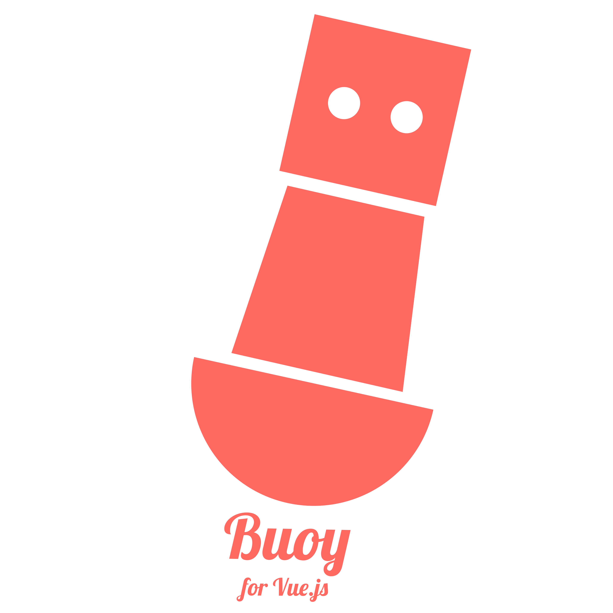

# buoy

Accessible Vue.js UI library

## Goals

The goal of the Buoy project is to create a beautiful, functional UI library for Vue.js that makes it easy for developers to follow the [Web Content Accessibility Guidelines guidelines](https://www.w3.org/WAI/intro/wcag).

https://pattern-library.dequelabs.com is a resource for an accessible UI library we can use for an example of accessibility techniques.

https://vuetifyjs.com/ is an extremely well-built Vue UI library to use as a reference for building components.

This project follows the Vue style guide: https://vuejs.org/v2/style-guide/ and the https://standardjs.com/ style guide.

## Live Style Guide and Documentation

You can view the live style guide and documentation [Here](https://fanappics.github.io/buoy/)

### Updating the style guide

1. Run `npm run build:docs` to build the project and copy the files into the `docs` directory
1. Make the appropriate changes in the `docs` directory.
